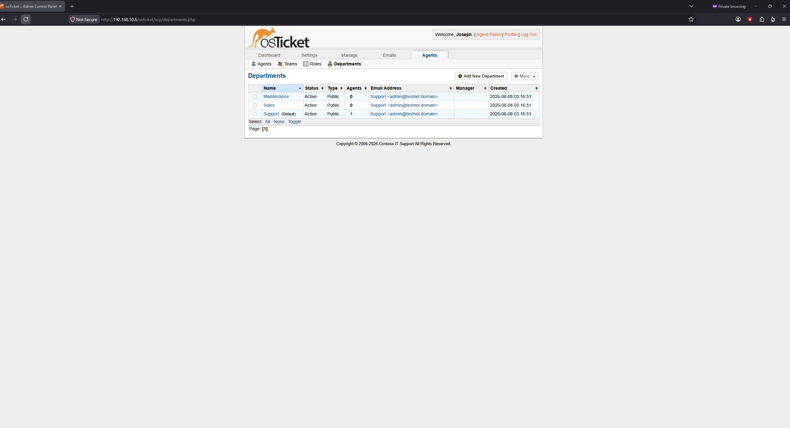
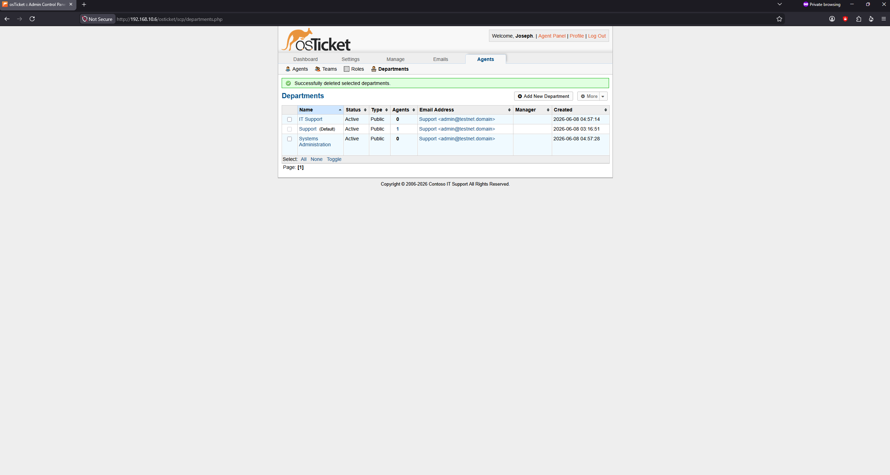
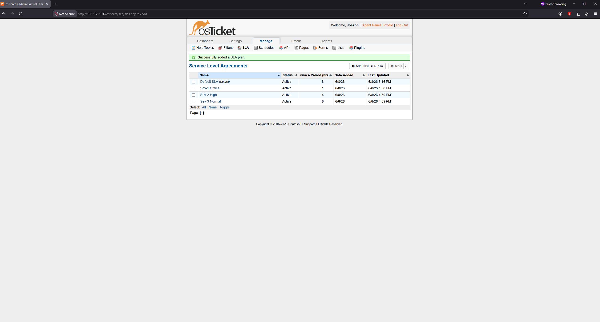
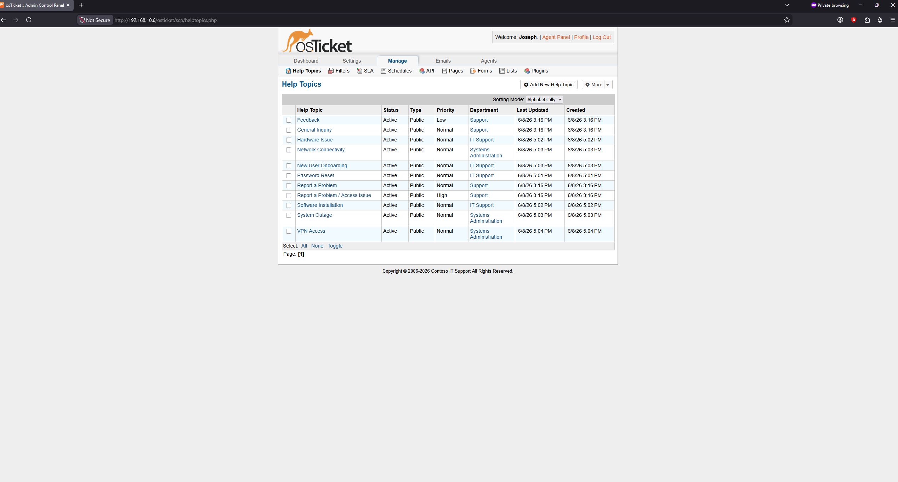
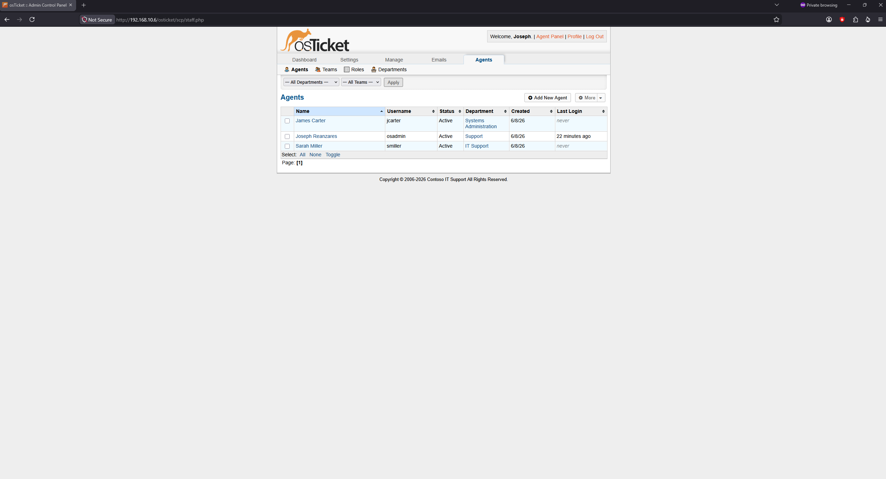
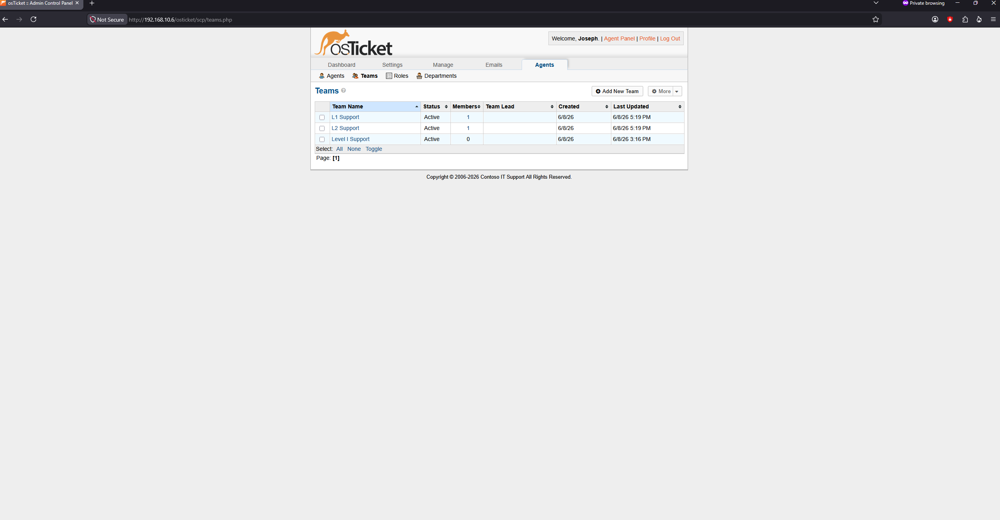
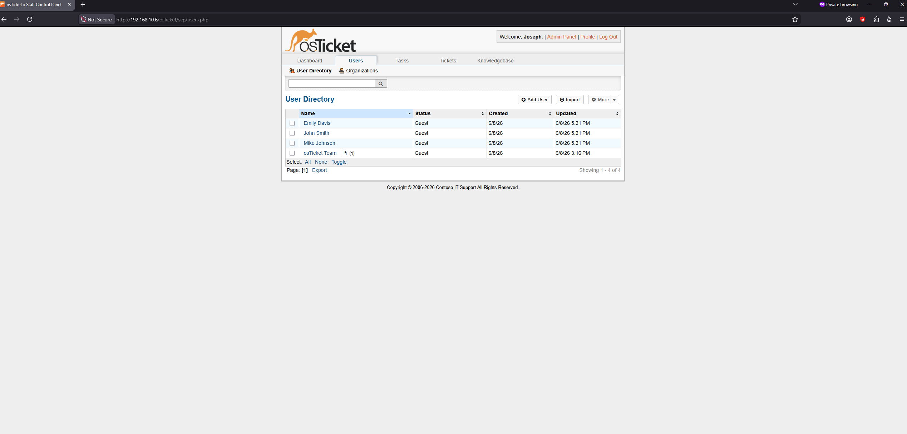

# Configuration

This page documents the osTicket configuration after installation — setting up departments, SLA plans, help topics, agents, teams, and users to simulate a real enterprise IT helpdesk environment for the fictional company Contoso.

---

## Overview

A freshly installed osTicket has generic placeholder data. This configuration phase transforms it into a structured helpdesk that mirrors how a real IT support team operates — with defined departments, escalation paths, response time commitments, and staff roles.

---

## Departments

Departments in osTicket represent the teams that handle tickets. Tickets are routed to departments based on their help topic, and agents belong to one or more departments.

### Default departments removed

osTicket ships with three placeholder departments: Maintenance, Sales, and Support. These were removed and replaced with departments that reflect a real IT support structure.

### Departments configured

| Department | Purpose |
|---|---|
| Support | Default catch-all department for general tickets |
| IT Support | Handles L1 issues — password resets, software, hardware |
| Systems Administration | Handles L2 issues — network, infrastructure, outages |

**Why separate departments:** In a real helpdesk, tickets are triaged and routed to the appropriate team. A password reset goes to IT Support (L1). A network outage goes to Systems Administration (L2). Separating departments allows different SLAs, agents, and escalation paths per team — which is how enterprise helpdesks actually operate.

---

## SLA Plans

SLA (Service Level Agreement) plans define how quickly tickets must be responded to and resolved. They set expectations for both the support team and the end user.

### SLA structure

| Plan | Grace Period | Schedule | Use Case |
|---|---|---|---|
| Sev-1 Critical | 1 hour | 24/7 | Complete outages, security incidents, systems down |
| Sev-2 High | 4 hours | 24/7 | Significant impact, degraded service, key system inaccessible |
| Sev-3 Normal | 8 hours | Mon-Fri 8am-5pm | Standard requests — password resets, software installs |
| Default SLA | 8 hours | Mon-Fri 8am-5pm | Fallback for tickets with no help topic assigned |

**Why 24/7 for Sev-1 and Sev-2:** Critical and high priority issues don't pause for weekends or holidays. If a server goes down Saturday night, the 1-hour clock is still running. Business hours schedules only apply to lower-priority work that can reasonably wait until the next working day.

**Why these timeframes:** These follow industry standard ITIL (IT Infrastructure Library) severity classifications. Sev-1 at 1 hour, Sev-2 at 4 hours, and Sev-3 at 8 business hours are common baselines in enterprise IT environments. Actual SLAs vary by organisation and are typically negotiated with the business.

---

## Help Topics

Help topics are the categories users select when submitting a ticket. They determine which department receives the ticket and which SLA applies. Well-defined help topics make ticket routing automatic and consistent.

### Help topics configured

| Help Topic | Department | SLA |
|---|---|---|
| Password Reset | IT Support | Sev-3 Normal |
| Software Installation | IT Support | Sev-3 Normal |
| Hardware Issue | IT Support | Sev-2 High |
| Network Connectivity | Systems Administration | Sev-2 High |
| New User Onboarding | IT Support | Sev-3 Normal |
| System Outage | Systems Administration | Sev-1 Critical |
| VPN Access | Systems Administration | Sev-2 High |

**Why these topics:** These cover the most common ticket types in a real IT helpdesk. Password resets and software installs are high-volume, low-urgency L1 work. Hardware issues and network connectivity problems have higher urgency. System outages are the highest priority. VPN access issues are common in environments with remote workers.

**How routing works:** When a user submits a ticket and selects "System Outage" as the help topic, osTicket automatically assigns it to the Systems Administration department with a Sev-1 Critical SLA — no manual triage needed. This is the core workflow of any modern helpdesk.

---

## Agents

Agents are the support staff who work tickets. Each agent belongs to a department and is assigned a role that controls what actions they can take.

### Agents configured

| Agent | Username | Department | Level |
|---|---|---|---|
| Joseph Admin | osadmin | All | Administrator |
| Sarah Miller | smiller | IT Support | L1 Support |
| James Carter | jcarter | Systems Administration | L2 Support |

**Why separate L1 and L2 agents:** In a real helpdesk, L1 agents handle first contact and straightforward issues. L2 agents handle escalations and more complex technical problems. Having agents in separate departments means tickets routed to IT Support go to Sarah (L1) and tickets routed to Systems Administration go to James (L2). This mirrors real enterprise helpdesk structure.

---

## Teams

Teams allow agents from different departments to collaborate on tickets. A team can be assigned a ticket regardless of which department it belongs to.

### Teams configured

| Team | Members | Purpose |
|---|---|---|
| L1 Support | Sarah Miller | First line response |
| L2 Support | James Carter | Escalation and complex issues |

**Why teams in addition to departments:** Departments control routing. Teams control collaboration. In a real environment, a major incident might need both L1 and L2 working together — a team assignment allows that without changing the ticket's department. Teams are also useful for on-call rotas and shift coverage.

---

## Users

Users are the end users who submit tickets — the people the helpdesk supports. In osTicket, users are separate from agents.

### Users configured

| Name | Email | Role |
|---|---|---|
| John Smith | john.smith@testnet.domain | End user |
| Emily Davis | emily.davis@testnet.domain | End user |
| Mike Johnson | mike.johnson@testnet.domain | End user |

These three users represent Contoso employees. They will be used in the ticket scenarios to simulate realistic support requests submitted by different staff members across the organisation.

---

## Configuration Complete

The osTicket helpdesk is now configured as a structured IT support environment with:

- ✅ 3 departments with clear L1/L2 separation
- ✅ 4 SLA plans covering critical through normal priority
- ✅ 7 help topics with automatic department routing and SLA assignment
- ✅ 3 agents across L1 and L2 tiers
- ✅ 2 teams for collaboration and escalation
- ✅ 3 end users for ticket simulation

➡️ [Continue to Ticket Scenarios](ticket-scenarios.md)