# Setup Guide

This page documents the full installation of the osTicket helpdesk lab — from creating the Ubuntu Server VM in Hyper-V through to a working osTicket instance accessible on the network.

---

## Environment

| Detail | Value |
|---|---|
| Host machine | HALLOWPC |
| Hypervisor | Microsoft Hyper-V |
| VM OS | Ubuntu Server 26.04 LTS |
| VM Name | osticket-server |
| IP Address | 192.168.10.6 |
| Gateway | 192.168.10.254 (pfSense) |
| DNS | 192.168.10.1, 192.168.10.2 (DC01, DC02) |
| Domain | TestNet.Domain |
| osTicket Version | v1.18.2 |
| PHP Version | 8.5.4 |

---

## Phase 1 — Ubuntu Server VM

### Creating the VM in Hyper-V

A new Generation 2 VM was created in Hyper-V Manager with the following settings:

| Setting | Value |
|---|---|
| Name | osticket-server |
| Generation | Generation 2 |
| RAM | 2048 MB (Dynamic Memory enabled) |
| Network | LabSwitch (same as domain controllers) |
| Disk | 20 GB |
| ISO | Ubuntu Server 26.04 LTS |

**Why Generation 2:** Gen 2 VMs support UEFI boot and modern hardware emulation. Gen 1 is legacy and not recommended for modern Linux installations.

**Why the same virtual switch as the DCs:** The osticket-server needs to communicate with DC01 and DC02 for DNS resolution and later for Active Directory LDAP authentication. Placing it on the same LabSwitch ensures direct network communication without additional routing configuration.

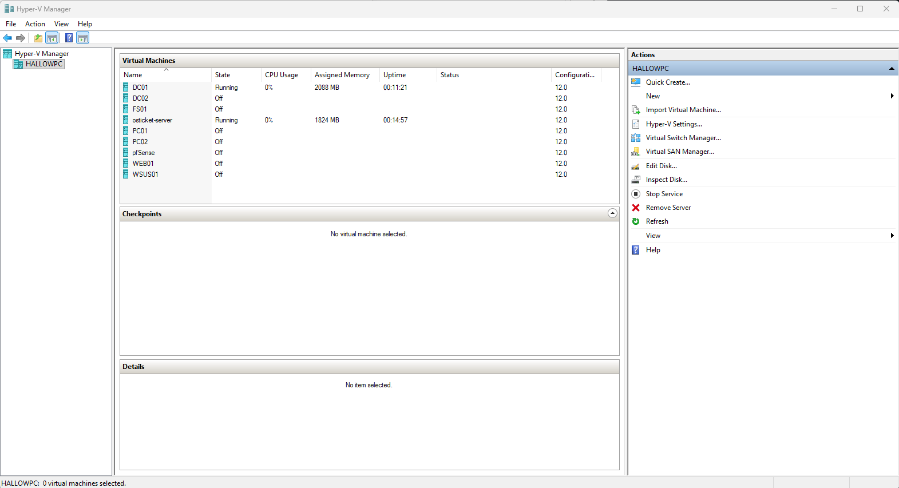

### Disabling Secure Boot

Before starting the VM, Secure Boot was disabled under:
**Settings → Security → uncheck Enable Secure Boot**

**Why:** Ubuntu's bootloader is not signed with Microsoft's Hyper-V certificate by default. With Secure Boot enabled, the VM refuses to boot. Disabling it allows Ubuntu to load normally. In a production environment the certificate would be added instead, but for a lab environment disabling Secure Boot is the standard approach.

### Installing Ubuntu Server

The Ubuntu Server installer was booted from the ISO. Key decisions during installation:

**Network configuration — static IP**
Rather than using DHCP, a static IP was configured manually during the install:

| Field | Value |
|---|---|
| Subnet | 192.168.10.0/24 |
| Address | 192.168.10.6 |
| Gateway | 192.168.10.254 |
| Name servers | 192.168.10.1, 192.168.10.2 |
| Search domains | TestNet.Domain |

**Why a static IP:** Servers must have static IPs. If the IP changed on every reboot, DNS records would break, clients couldn't reliably connect to the web server, and the AD integration would fail. Every server in this lab environment uses a static IP for the same reason.

**Why pfSense as the gateway:** pfSense at 192.168.10.254 is the lab's router and firewall. All traffic leaving the 192.168.10.0/24 network — including package downloads — routes through it.

**Why the DCs as DNS servers:** DC01 and DC02 run DNS for the TestNet.Domain domain. Pointing the Ubuntu server's DNS at the DCs allows it to resolve domain names like `dc01.testnet.domain`, which is required for Active Directory LDAP authentication in Phase 4.

**Storage:** Default guided layout using the entire 20GB disk with LVM. Encryption was not enabled — in a lab environment requiring a passphrase on every boot is impractical.

**Profile:**
| Field | Value |
|---|---|
| Server name | osticket-server |
| Username | osadmin |

**OpenSSH:** Enabled during installation. This allows remote management of the server over SSH from the host machine, which is far more practical than using the Hyper-V console for every command.

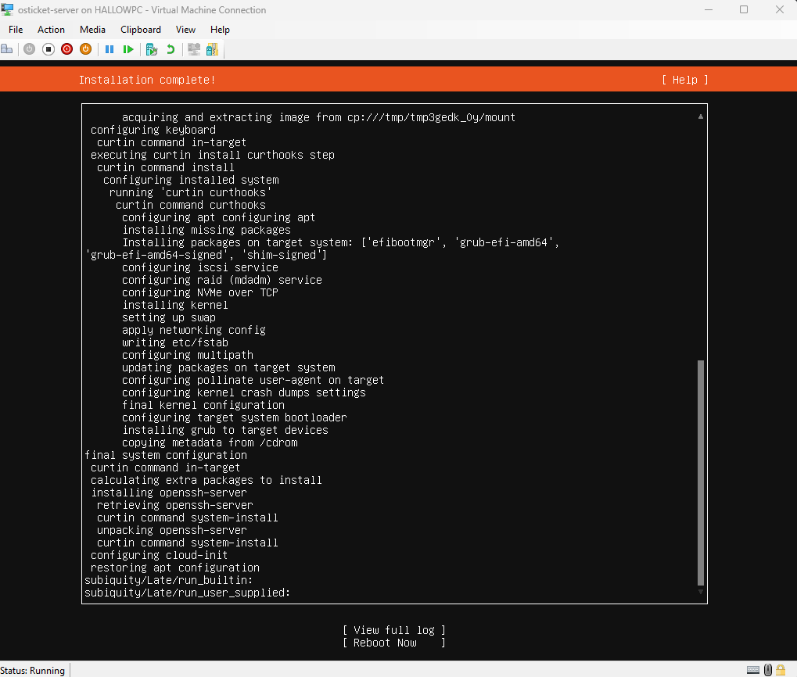
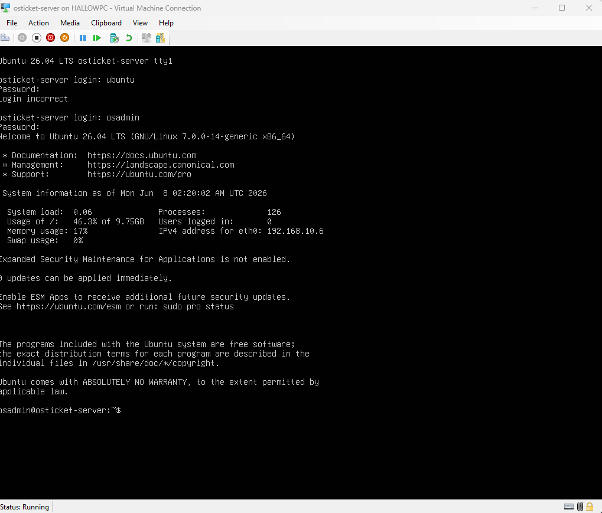

### Verifying Network Configuration

After first login, the network configuration was verified:

```bash
ip a
```

Output confirmed `eth0` was UP with the correct static IP `192.168.10.6/24`.

```bash
ping -c 4 8.8.8.8
```

Ping to 8.8.8.8 succeeded, confirming internet connectivity through pfSense — required for downloading packages.

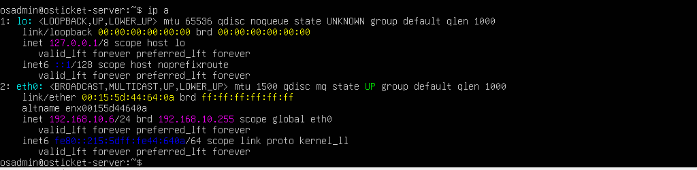


### System Update

```bash
sudo apt update && sudo apt upgrade -y
```

The system was updated before installing any packages to ensure all dependencies are current and security patches are applied.

---

## Phase 2 — LAMP Stack

The LAMP stack (Linux, Apache, MySQL, PHP) is the foundation osTicket runs on. osTicket is a PHP web application that stores data in MySQL and is served by Apache.

### Apache

```bash
sudo apt install apache2 -y
sudo systemctl enable apache2
sudo systemctl start apache2
```

**Why Apache:** Apache is the web server. When a user browses to the osTicket URL, Apache receives the HTTP request, passes PHP files to the PHP interpreter, and returns the rendered HTML to the browser.

**Why `systemctl enable`:** Configures Apache to start automatically on boot. Without this, the web server would need to be started manually every time the VM restarts.

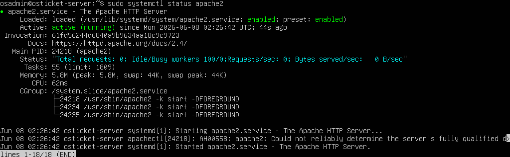

### MySQL

```bash
sudo apt install mysql-server -y
sudo mysql_secure_installation
```

**Why MySQL:** osTicket stores all of its data in MySQL — every ticket, user, agent, department, setting, and email thread. MySQL runs as a background service; Apache and PHP communicate with it behind the scenes.

**Why `mysql_secure_installation`:** The default MySQL installation has no root password, allows anonymous logins, and includes a test database — all security risks. This script removes anonymous users, disables remote root login, removes the test database, and sets a root password. This is the minimum hardening step before using MySQL in any environment.

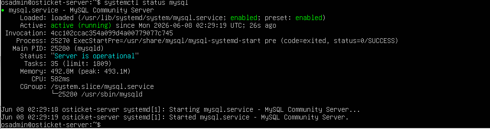

### PHP and Extensions

```bash
sudo apt install php libapache2-mod-php php-mysql php-intl php-apcu \
php-gd php-xml php-mbstring php-zip php-curl php-ldap -y
```

**Why each extension:**

| Extension | Purpose |
|---|---|
| `php` | Core PHP interpreter — executes `.php` files |
| `libapache2-mod-php` | Connects Apache and PHP — without this Apache serves raw PHP code instead of executing it |
| `php-mysql` | Allows PHP to communicate with MySQL — used for every database operation in osTicket |
| `php-intl` | Internationalisation support for handling multiple languages and character sets |
| `php-apcu` | In-memory caching — stores frequently accessed data to reduce database queries and improve performance |
| `php-gd` | Image processing — handles image attachments on tickets |
| `php-xml` | XML processing used internally by osTicket and PHP |
| `php-mbstring` | Multibyte string support — ensures ticket content with special or non-Latin characters is handled correctly |
| `php-zip` | ZIP file handling for osTicket file operations and plugin installs |
| `php-curl` | Allows PHP to make outbound HTTP requests — used for osTicket API calls |
| `php-ldap` | **Critical for Phase 4** — enables osTicket to communicate with Active Directory over LDAP for user authentication |

> **Note:** `php-imap` is not available as a standalone package on Ubuntu 26.04. This only affects email-to-ticket functionality and does not impact core osTicket operation or AD integration.

```bash
sudo systemctl restart apache2
```

Apache was restarted after PHP installation so it detects and loads the `libapache2-mod-php` module. Without this restart, Apache would not know PHP is installed.


### Verifying the Stack

The Apache default page was confirmed accessible from the host machine at `http://192.168.10.6`, confirming Apache is serving pages and the network routing through pfSense is working correctly.

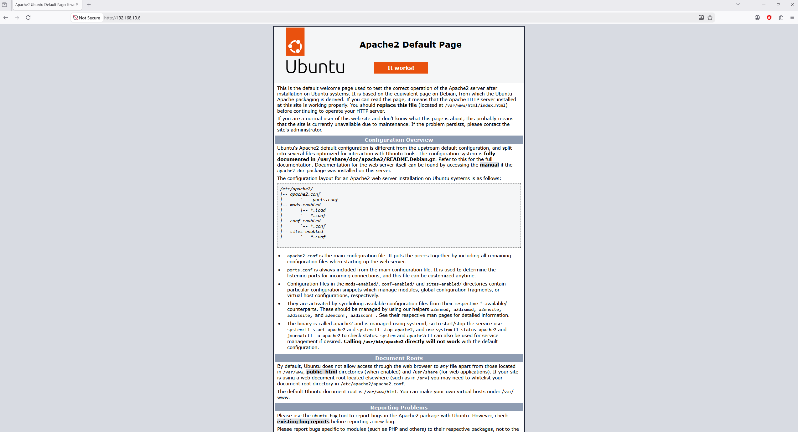

---

## Phase 3 — osTicket Installation

### Database Setup

A dedicated MySQL database and user were created for osTicket:

```sql
CREATE DATABASE osticket;
CREATE USER 'osticket'@'localhost' IDENTIFIED BY '<password>';
GRANT ALL PRIVILEGES ON osticket.* TO 'osticket'@'localhost';
FLUSH PRIVILEGES;
```

**Why a dedicated user:** Best practice is never to let an application use the MySQL root account. A dedicated `osticket` user with access only to the `osticket` database limits the blast radius if the application were ever compromised — the attacker would only have access to osTicket's data, not every database on the server.

**Why `@'localhost'`:** Restricts this user to connections from the local machine only. osTicket and MySQL are on the same server, so there is no reason to allow remote database connections.

**Why `FLUSH PRIVILEGES`:** Forces MySQL to reload its permission tables immediately so the new user and grants take effect without requiring a service restart.

### Downloading osTicket

```bash
cd /tmp
wget https://github.com/osTicket/osTicket/releases/download/v1.18.2/osTicket-v1.18.2.zip
sudo apt install unzip -y
unzip osTicket-v1.18.2.zip -d osTicket
```

Downloaded to `/tmp` as a temporary workspace before moving files to their permanent location. osTicket v1.18.2 was downloaded directly from the official GitHub releases page.

### Installing Files

```bash
sudo cp -r /tmp/osTicket/upload /var/www/html/osticket
sudo cp /var/www/html/osticket/include/ost-sampleconfig.php \
        /var/www/html/osticket/include/ost-config.php
sudo chmod 0666 /var/www/html/osticket/include/ost-config.php
sudo chown -R www-data:www-data /var/www/html/osticket
```

**Why `/var/www/html/`:** This is Apache's document root — the directory it serves files from. Placing osTicket here makes it accessible at `http://192.168.10.6/osticket/`.

**Why copy the sample config:** osTicket ships with a sample config as a template. The web installer writes database credentials and settings into the actual `ost-config.php` file during setup.

**Why `chmod 0666`:** The web installer runs as the `www-data` user (Apache's service account) and needs write access to the config file to save settings. This is temporary — the file is locked down after install.

**Why `chown www-data`:** Apache runs as `www-data`. For Apache to read, serve, and write osTicket files it must own them. The `-R` flag applies ownership recursively to all files and subdirectories.

### Apache Virtual Host Configuration

```bash
sudo nano /etc/apache2/sites-available/osticket.conf
```

```apache
<VirtualHost *:80>
    ServerName osticket-server
    DocumentRoot /var/www/html/osticket
    <Directory /var/www/html/osticket>
        AllowOverride All
        Require all granted
    </Directory>
</VirtualHost>
```

```bash
sudo a2ensite osticket.conf
sudo a2enmod rewrite
sudo systemctl reload apache2
```

**Why a virtual host config:** Apache needs a configuration file to know how to handle requests for osTicket — where the files are, what hostname to respond to, and what permissions apply.

**Why `AllowOverride All`:** Allows osTicket's `.htaccess` file to control URL rewriting. osTicket uses clean URLs (e.g. `/osticket/tickets/123`) — without this directive those URLs return 404 errors.

**Why `a2ensite`:** Apache does not automatically use every config file in `sites-available`. `a2ensite` creates a symlink into `sites-enabled`, which is the directory Apache actually reads.

**Why `mod_rewrite`:** The Apache module that handles URL rewriting. Required for osTicket's clean URL structure to function.

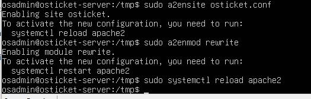

### Web Installer

The web installer was run by browsing to `http://192.168.10.6/osticket/setup/` from the host machine.

All required prerequisites showed green checkmarks. The missing `php-imap` extension (shown with an X) only affects email-to-ticket functionality and does not block installation.


The installation form was completed with:
- Helpdesk Name: Contoso IT Support
- Admin account created for day-to-day management
- Database credentials pointing to the `osticket` MySQL database created earlier

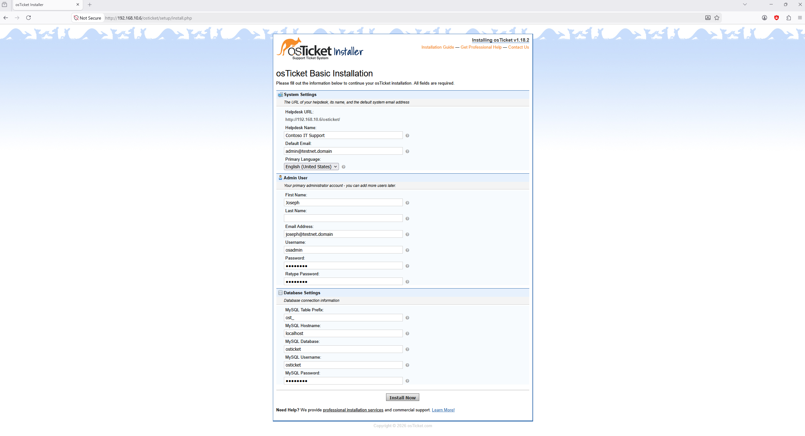
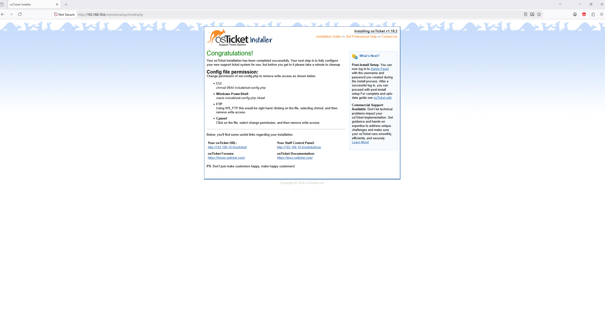
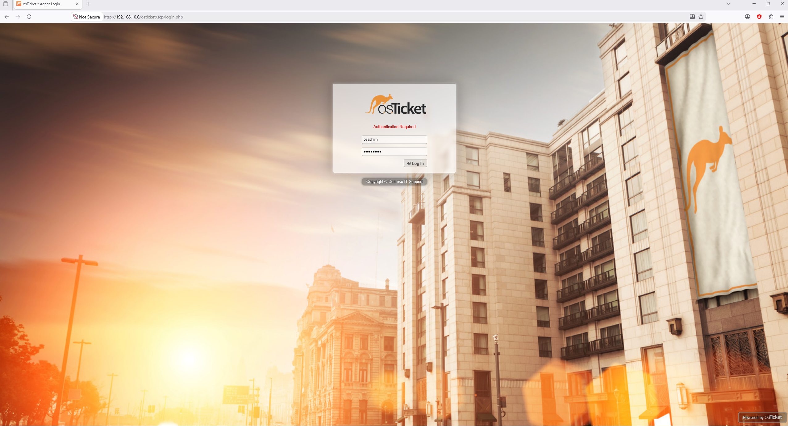

### Post-Install Cleanup

```bash
sudo chmod 0644 /var/www/html/osticket/include/ost-config.php
sudo rm -rf /var/www/html/osticket/setup
```

**Why lock the config file:** The config file was temporarily set to world-writeable for the installer. After installation it is locked back to read-only (0644) to prevent unauthorised modification.

**Why remove the setup folder:** Leaving the setup directory in place is a critical security vulnerability. Anyone who browses to `/osticket/setup/` could re-run the installer and overwrite the entire configuration. It must be deleted immediately after installation.

### Confirming the Installation

osTicket Staff Control Panel was accessed at `http://192.168.10.6/osticket/scp` and login was confirmed with the admin credentials.

**Why `/scp`:** The Staff Control Panel is the backend interface for agents and administrators. The root `/osticket/` URL is the customer-facing portal for submitting tickets.

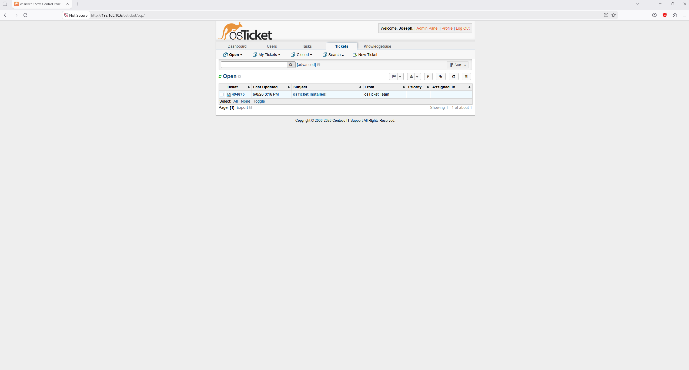

---

## Phase 3 Complete

osTicket v1.18.2 is installed and accessible on the network. The LAMP stack is confirmed working. The next phase connects osTicket to the existing Active Directory domain for LDAP authentication.

➡️ [Continue to AD Integration](ad-integration.md)