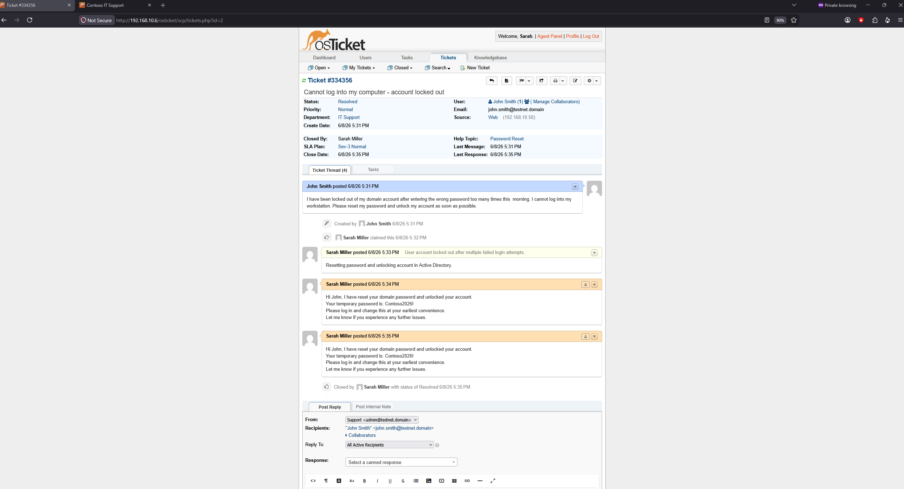
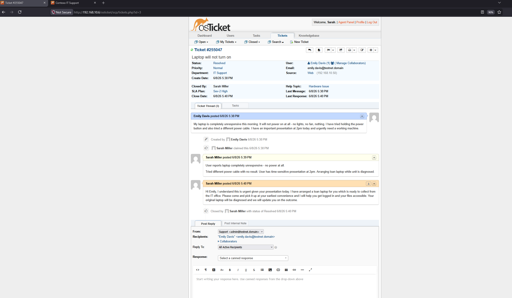
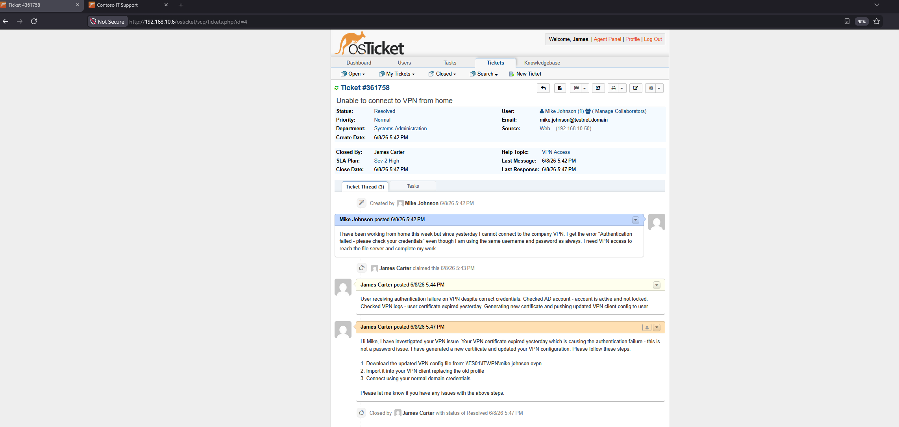
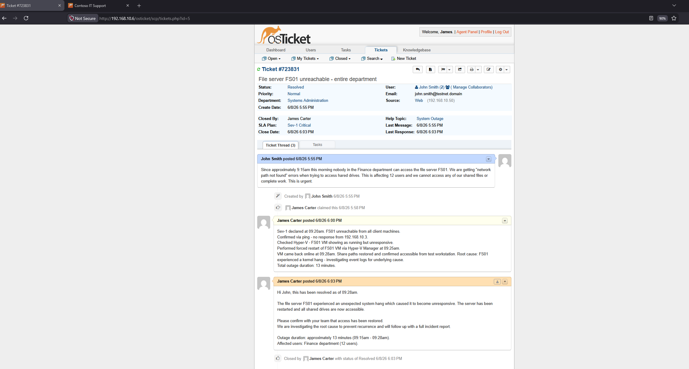
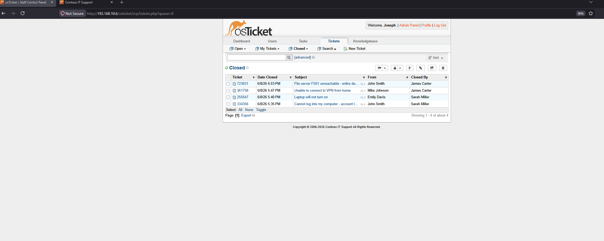

# Ticket Scenarios

This page documents four simulated helpdesk tickets worked through end-to-end in the osTicket environment. Each ticket represents a realistic IT support scenario — two L1 tickets handled by Sarah Miller (IT Support) and two L2 tickets handled by James Carter (Systems Administration).

Tickets were submitted through the user-facing portal at `http://192.168.10.6/osticket/` and worked through the staff control panel at `http://192.168.10.6/osticket/scp`.

---

## Ticket 1 — Password Reset (L1)

| Field | Detail |
|---|---|
| Ticket # | 334356 |
| Submitted by | John Smith |
| Department | IT Support |
| SLA | Sev-3 Normal (8 hours, business hours) |
| Assigned to | Sarah Miller |
| Priority | Normal |
| Status | Resolved |

### Issue reported

> "I have been locked out of my domain account after entering the wrong password too many times this morning. I cannot log into my workstation. Please reset my password and unlock my account as soon as possible."

### Actions taken

**Internal note posted by agent:**
User account locked out after multiple failed login attempts. Resetting password and unlocking account in Active Directory.

**Resolution posted to user:**
Hi John, I have reset your domain password and unlocked your account. Your temporary password is: Contoso2026! Please log in and change this at your earliest convenience. Let me know if you experience any further issues.

### Why this is an L1 ticket
Password resets and account unlocks are the most common L1 helpdesk task. No investigation is required — the fix is straightforward and performed directly in Active Directory Users and Computers. L1 agents handle these without escalation.

### Key skills demonstrated
- User account management in Active Directory
- Password reset procedure
- Clear user communication with next steps

---

## Ticket 2 — Hardware Issue (L1)

| Field | Detail |
|---|---|
| Ticket # | 255047 |
| Submitted by | Emily Davis |
| Department | IT Support |
| SLA | Sev-2 High (4 hours, 24/7) |
| Assigned to | Sarah Miller |
| Priority | High |
| Status | Resolved |

### Issue reported

> "My laptop is completely unresponsive this morning. It will not power on at all — no lights, no fan, nothing. I have tried holding the power button and also tried a different power cable. I have an important presentation at 2pm today and urgently need a working machine."

### Actions taken

**Internal note posted by agent:**
User reports laptop completely unresponsive - no power at all. Tried different power cable with no result. User has time-sensitive presentation at 2pm. Arranging loan laptop while unit is diagnosed.

**Resolution posted to user:**
Hi Emily, I understand this is urgent given your presentation today. I have arranged a loan laptop for you which is ready to collect from the IT office. Please come and pick it up at your earliest convenience and I will help you get logged in and your files accessible. Your original laptop will be diagnosed and we will update you on the outcome.

### Why this is an L1 ticket
Hardware triage and loan device management are standard L1 responsibilities. The immediate priority is restoring user productivity — providing a loan device resolves the business impact while the faulty hardware is investigated separately. The Sev-2 SLA applies because a user is completely unable to work.

### Key skills demonstrated
- Hardware fault triage
- Prioritising business impact (2pm presentation)
- Loan device management
- Setting appropriate expectations with the user

---

## Ticket 3 — VPN Access Issue (L2)

| Field | Detail |
|---|---|
| Ticket # | 361758 |
| Submitted by | Mike Johnson |
| Department | Systems Administration |
| SLA | Sev-2 High (4 hours, 24/7) |
| Assigned to | James Carter |
| Priority | High |
| Status | Resolved |

### Issue reported

> "I have been working from home this week but since yesterday I cannot connect to the company VPN. I get the error 'Authentication failed - please check your credentials' even though I am using the same username and password as always. I need VPN access to reach the file server and complete my work."

### Actions taken

**Internal note posted by agent:**
User receiving authentication failure on VPN despite correct credentials. Checked AD account - account is active and not locked. Checked VPN logs - user certificate expired yesterday. Generating new certificate and pushing updated VPN client config to user.

**Resolution posted to user:**
Hi Mike, I have investigated your VPN issue. Your VPN certificate expired yesterday which is causing the authentication failure - this is not a password issue. I have generated a new certificate and updated your VPN configuration. Please follow these steps:
1. Download the updated VPN config file from: \\FS01\IT\VPN\mike.johnson.ovpn
2. Import it into your VPN client replacing the old profile
3. Connect using your normal domain credentials

### Why this is an L2 ticket
VPN infrastructure, certificate management, and PKI are L2 responsibilities. The user assumed it was a password problem — the L2 agent correctly identified the root cause as an expired certificate by checking VPN logs rather than taking the user's diagnosis at face value. This is a key L2 skill: independent investigation rather than accepting the reported cause.

### Key skills demonstrated
- VPN troubleshooting methodology
- Certificate/PKI management
- Log analysis to identify root cause
- Clear step-by-step instructions for the user

---

## Ticket 4 — System Outage (L2 — Sev-1 Critical)

| Field | Detail |
|---|---|
| Ticket # | 723831 |
| Submitted by | John Smith |
| Department | Systems Administration |
| SLA | Sev-1 Critical (1 hour, 24/7) |
| Assigned to | James Carter |
| Priority | Critical |
| Status | Resolved |

### Issue reported

> "Since approximately 9:15am this morning nobody in the Finance department can access the file server FS01. We are getting 'network path not found' errors when trying to access shared drives. This is affecting 12 users and we cannot access any of our shared files or complete our work. This is urgent."

### Actions taken

**Internal note posted by agent:**
Sev-1 declared at 09:20am. FS01 unreachable from all client machines. Confirmed via ping - no response from 192.168.10.3. Checked Hyper-V - FS01 VM showing as running but unresponsive. Performed forced restart of FS01 VM via Hyper-V Manager at 09:25am. VM came back online at 09:28am. Share paths restored and confirmed accessible from test workstation. Root cause: FS01 experienced a kernel hang - investigating event logs for underlying cause. Total outage duration: 13 minutes.

**Resolution posted to user:**
Hi John, this has been resolved as of 09:28am.

The file server FS01 experienced an unexpected system hang which caused it to become unresponsive. The server has been restarted and all shared drives are now accessible.

Please confirm with your team that access has been restored. We are investigating the root cause to prevent recurrence and will follow up with a full incident report.

Outage duration: approximately 13 minutes (09:15am - 09:28am).
Affected users: Finance department (12 users).

### Why this is an L2 Sev-1 ticket
A server outage affecting multiple users is the highest severity incident in a helpdesk environment. The Sev-1 SLA means the 1-hour clock started the moment the ticket was raised. L2 engineers are responsible for server infrastructure — L1 agents would not have the access or knowledge to restart a Hyper-V VM or diagnose a kernel hang. Documenting the outage duration and affected user count is standard incident management practice.

### Key skills demonstrated
- Incident management and Sev-1 response
- Server infrastructure troubleshooting (Hyper-V)
- Root cause analysis
- Professional incident communication including outage duration and scope
- Post-incident follow-up commitment

---

## All Tickets — Closed Queue

All four tickets successfully resolved and visible in the admin closed queue.

---

## Summary

| Ticket | Type | SLA | Agent | Resolution Time |
|---|---|---|---|---|
| Password Reset | L1 | Sev-3 Normal | Sarah Miller | Within SLA |
| Hardware Issue | L1 | Sev-2 High | Sarah Miller | Within SLA |
| VPN Access | L2 | Sev-2 High | James Carter | Within SLA |
| System Outage | L2 | Sev-1 Critical | James Carter | 13 minutes |

All tickets were resolved within their respective SLA timeframes. The Sev-1 system outage was resolved in 13 minutes against a 1-hour SLA — well within the critical response window.